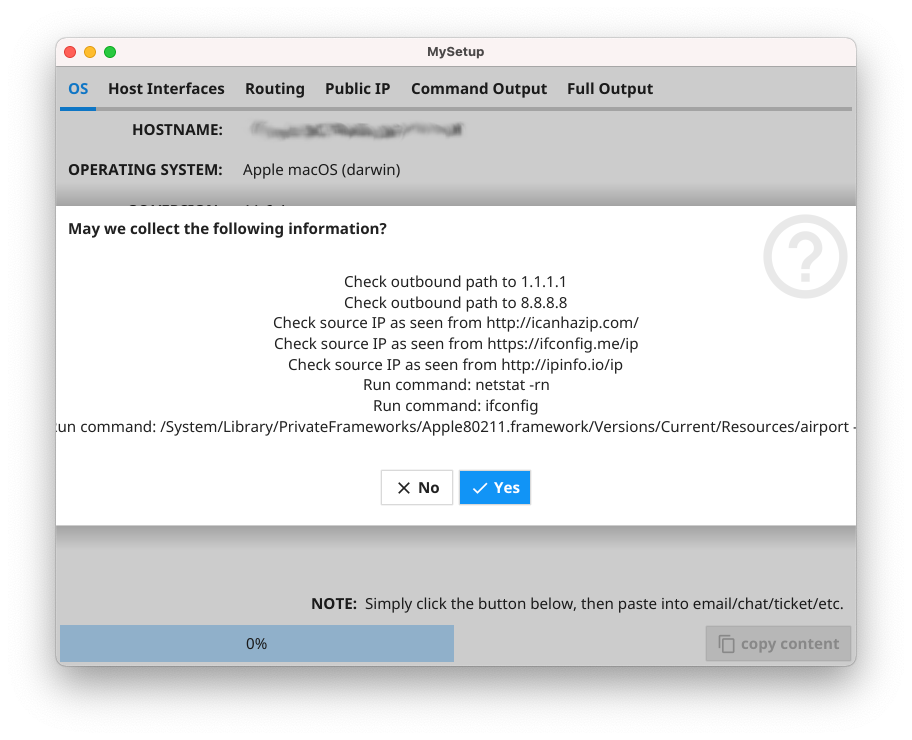
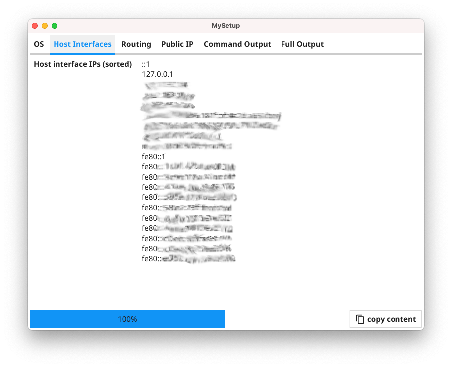
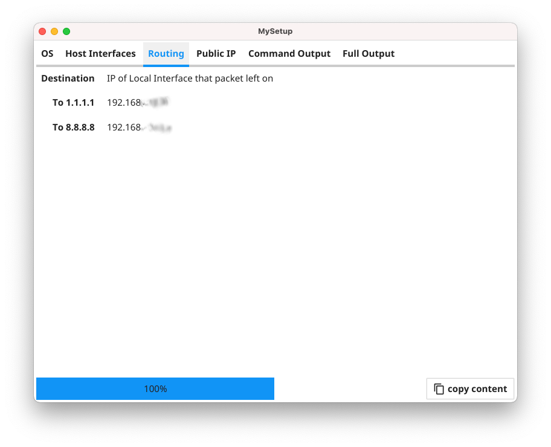
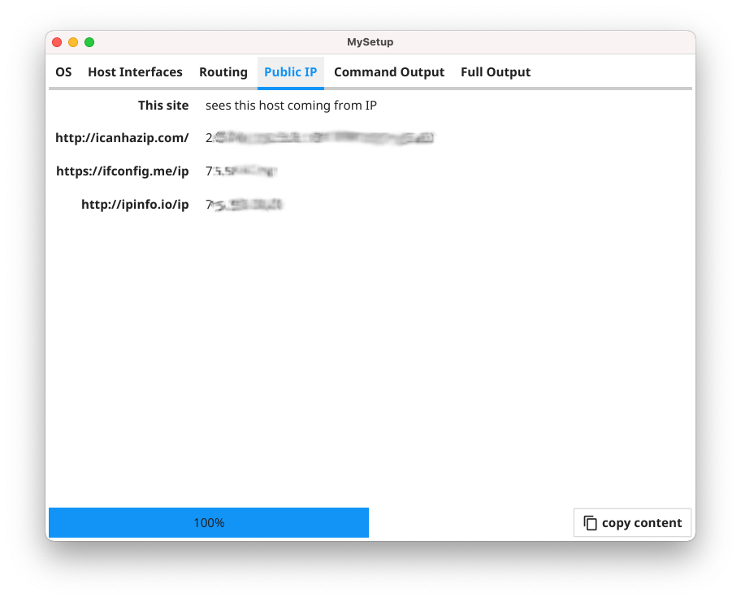
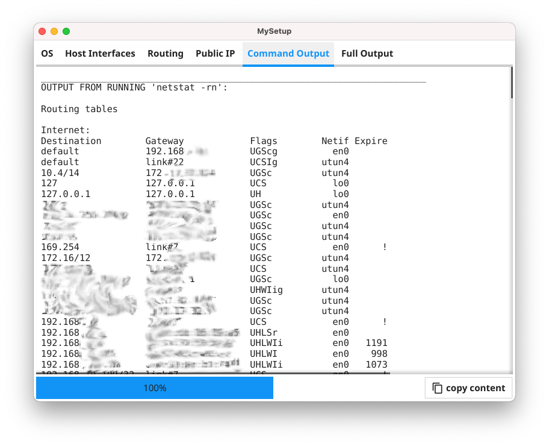
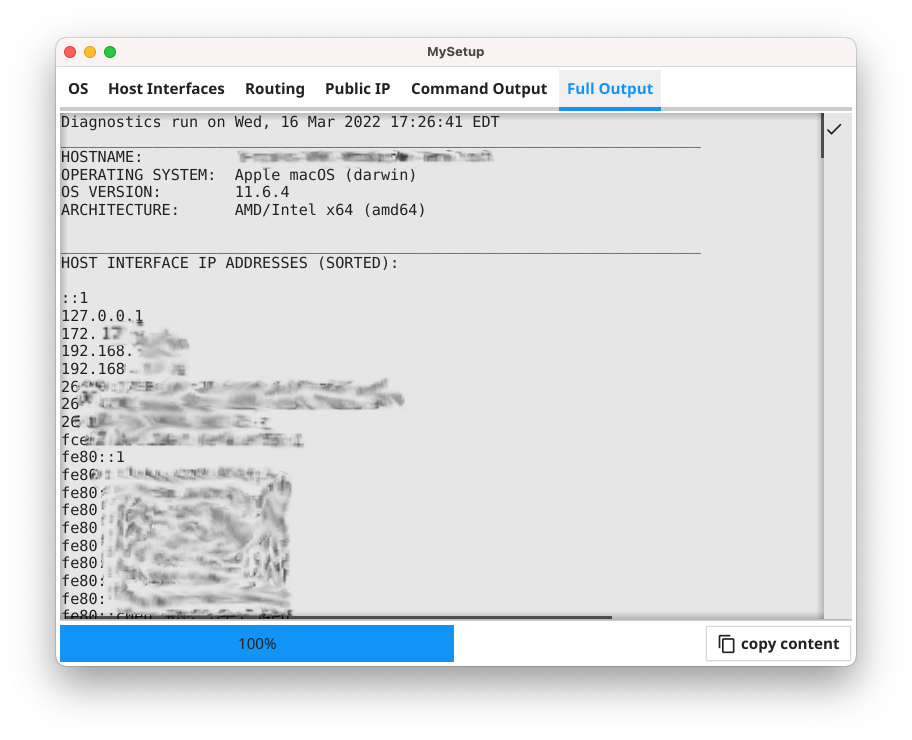

# MySetup
Simple network diagnostic utility for collecting information about a host.

It is written in [Go](https://go.dev/) using the [Fyne.io](https://fyne.io/) GUI toolkit.




# Purpose

You find yourself needing to help someone who is having network trouble with their computer.  
Maybe you just want to help a family member.  
Maybe you work a helpdesk supporting desktop users.  
Maybe you provide Tier 3 networking support in an environment where users

* could be anywhere (e.g., work, home)
* might be VPN'd in (or not... or don't know)
* possibly have their DNS configuration mangled... or not... or using a provider's DNS servers which are misfiring
* have a mangled routing table
* etc.

The point is, you have a user having problems, and you want to resolve the issue as quickly as possible.  The challenge, often enough, is simply collecting the necessary information you need that helps you troubleshoot the problem.

Now imagine that you could simply point the user at a website, where they simply download a file, run that file, and it does all the necessary data collection on your behalf.  All the user has to do is confirm the data collection, then copy/paste the results, be it to an email, a chat, or a ticketing system.

This program is intended to serve as a baseline template for exactly that utility.  It is designed to be a self-contained single binary utility which, when downloaded and run on a system, executes various basic network troubleshooting steps and collects information such as

* Hostname, OS/version, and architecture
* Host interface IP info
* Preferred outbound IPs showing local interface that routes take to specific sites
* What public IP the host appears to source from, as seen from different sites
* Output of various simple CLI commands executed based on the OS of the host  
(e.g., in example settings, for macOS and Linux it runs `netstat -rn` while for Windows it runs `route print`)

The app is a single window application.  When started, it only collects local information at first, such as hostname, OS/version, architecture, and local interface IP addresses.  Before it does anything else, it provides a confirmation dialog box showing the

* IPs
* sites
* and commands

that were compiled in via the `settings.go` file. (This is the only file you need to modify to tune this utility for your own environment.  Check out the `settings.go.example` for a base sample config.  But note if you can execute a command on the command line, this utility should be able to collect the output.)  The dialog asks the user whether the utility is allowed to collect the information.  If the user chooses `[Yes]`, the program continues.  It the user chooses `[No]`, the application quits.  This was done so the program would neither attempt any network connections nor run any local commands without the user's express permission.

Once the user confirms, the program spins up goroutines for each of the actions it is taking.  It tracks the progress using a progress bar in the lower left.  The idea here is that if someone adds in a long list of items for the utility to gather, the concurrent execution will collect the information as quickly as possible, while the progress bar lets the user know how many of the total actions have been completed.  Once the progress bar reaches 100%, the `[copy content]` button is no longer greyed out.

The informationn collected is presented in the main window, where it is broken down into several tabs across the top.  The final tab offers a text-based version of the full contents collected.  This information can be selectively highlighted and copy/pasted from that final tab.  There is also the `[copy content]` button which, when pressed, copies the entire contents of the final tab into the OS's clipboard for easy pasting into such things as emails or ticketing systems.

All of this was intentional.  The user must be the one to copy/paste the information, whether whole or in part, somewhere such as an email, a chat session, or an online ticketing system such as ServiceNow.  This way the user is always in control of their data.  THEY are the final arbiter whether they share their information.


# Screenshots









# How to Build

Please see the [`BUILD.md`](https://github.com/fseesink/MySetup/blob/main/BUILD.md) page for full details.  But generally speaking, to build this utility from source, once you have your development environment setup, simply

1. Clone this rep  
```
git clone https://github.com/fseesink/MySetup.git
```
2. Copy/rename `settings.go.example` to `settings.go`  
```
cp settings.go.example settings.go
```
3. Adjust the outboundIPs, publicsites, and commands variables, etc. in `settings.go` to your taste
4. Optionally copy a different icon file in as `Icon.png` to provide branding
5. Compile the application

If you are on a macOS-based system, you can also

6. Copy in or use an entirely different icon file (e.g., `MyIcon.png`)
7. Copy/rename `buildapp.sh.example` to `buildapp.sh`
```
cp buildapp.sh.example buildapp.sh
```
8. Modify the variables at the top of `buildapp.sh` to specify app name, version, build, and /path/to/iconfile, etc.
9. Make sure that you have **Docker** running
10. Run
```
./buildapp.sh
```
to generate both a `.DMG` containing a macOS Universal Binary application and a Windows 64-bit `.exe.zip` file for distribution, stored in a folder on your Desktop.

You can then post these binaries on a website or otherwise distribute them to folks.  Users run the program.  It collects the data.  Then the users copy/paste the information from the utility to whatever mechanism you use (email, ServiceNow ticket, etc.).  And you have information that often takes much longer to gather otherwise.

**NOTE:**
> `buildapp.sh.example` is exactly that.  Just an example.  It was written for my own use and then sanitized before I posted it here.  But it should give you enough information to modify/tweak to your own desires.


# History

## How it Began
At one point I was in a bit of rut doing my Python/Django coding work.  So as any geek might, I thought the best way to get out of my rut was... to learn another programming language!  Yeah, I know.  Nuts, right? :-)

Well, to learn any programming language, you really need to code in that language.  Reading about a language is nice, but there is no substitute for actual coding.  And this is how this all began.

I was noting where Go existed in the pantheon of programming languages.  That is, every programming language out there was created initially due to some need or purpose.  As much as some might like to think otherwise, there is no universal programming language that is best suited for every task.  You would no more want to write a web application in assembler than try to write an operating system in SQL.

Well Go was created by many of the same folks who originally created C.  The way I explain it to others is that these developers looked at the previous 30 years of programming experience, and they then invented the language they would have invented 30 years earlier had they known these things.  (Though to be fair, the hardware wasn't ready for this then.)

I once told a friend that Go looked like C and Python had a baby... and then they did some gene therapy and mixed in a little Pascal and other language bits here and there. :-)

Now using Python as a counterexample, let's look at where Go fits into the programming language landscape.

* **Python** is *interpreted*, meaning its code must be fed into an interpreter which translates and executes the code each time it runs.
* **Go** is *compiled*, meaning you run your source code through a compiler just once and are left with a binary executable which is what you run each time.  Typically you just enter `go build <file>.go` to compile a go program that is in a single file or `go build .` to build a directory of files.
* **Python** is *dynamic typed*.  A variable can hold a string one minute, then an integer the next.
* **Go** is *strongly typed*.  You either outright declare what type of information a variable holds (e.g., `var name string`) or you let the compiler infer it the first time it encounters the variable (e.g., `name := "Frank"` will result in `name` being a string variable).  Either way, that variable will only ever be allowed to store one type of data.
* **Python** applications require a Python interpreter and all relevant modules to be installed on each system that runs the applications.
* **Go** binaries have no external dependencies.  And this is key.  When you compile a Go app, the resulting binary, built for a specific OS/architecture, is all that is needed.  (No "DLL hell" as in MS Windows.)
* **Python** code by default will never use more than a single core, even on a multi-core system, due to the GIL (Global Interpreter Lock).  You can get around this by leveraging the `concurrent.futures` module--which lets you use threads (which stay within a single core) or processes (one per core)--or using the `asyncio` module for cooperative threads (i.e., coroutines).  However, the onus is on you to get around the GIL.
* **Go** was built with concurrency in mind and will leverage every core in a system.  Go actually makes writing concurrency code quite easy.
* **Python** has garbage collection.  So does **Go**.
* **Python** is known for allowing developers to iterate over their code very quickly, making a change here or there and running the code again.
* **Go**'s developers made the go compiler extremely fast, complete with an option to do a `go run <file>.go` which compiles/executes a Go program in memory in one shot, nearly replicating the Python experience.
* **Python** has a REPL (Read Evaluate Process Loop).  That is, you can enter the Python interpreter and execute Python commands/functions interactively, which is very handy for testing.  **Go** does not offer this.

In my experience, and thanks to actually going through this exercise, nothing beats Python for rapid, iterative testing and development.  And for quick scripting, Python is the tops.  That said, if performance and concurrency are important, especially in long-running applications, then Go might be a better fit.

I could go on, but you get the point.  I will leave it at this.

First, Go, unlike C, has garbage collection.  That implies overhead.  I wanted to know just how much overhead that meant.

Now if you write a "Hello World" app in each of Python and Go, here’s what you see.  For Python, all you really need is
```
#!/usr/bin/python
print("Hello world")
```
That’s maybe 40 bytes? (The first line isn't even needed, but it's handy if you set the Python file to be executable.)  And then you need the Python interpreter, which currently runs ~15 MB _JUST_ for the Python3 interpreter binary.  That does not even include all the "batteries included" libraries you install.

To be truly fair, looking at my setup on my Mac, Python 3.10 looks to take up…

* `/Library/Frameworks/Python.framework/Versions/3.10/` ~908 MB
* `/Library/Frameworks/Python.framework/Versions/3.10/lib/python3.10/site-packages` (which holds all the pip modules I’ve installed at the system level) ~698 MB

So we’ll say **~200 MB** for the full Python interpreter install.  So that means you really need 200 MB + 40 bytes to run the Python version of "Hello World".  Even if you could just bundle the interpreter, it's still 15 MB.

Now, if you write the equivalent minimal app in Go:
```
package main
import "fmt"

func main() {
    fmt.Println("Hello World")
}
```

and compile it, on the Mac at least, the resulting binary is **< 2 MB**.  That is _EVERYTHING_.  Remember, this is a compiled language.  That means ALL of the overhead from adding in a garbage collector/etc. to handle memory management/etc. is about that:  ~2 MB, because the code to print "Hello world" is a joke.

## And then...

Now as I have done in the past with other languages, as I began learning basic Go coding, I wanted to see if there were any toolkits/frameworks for building GUI applications with it.  Now the holy grail for programmers would be a single programming language and API/toolkit that let them build applications for every major OS.  Back in the 90's this was the promise of Java, with its "Write Once, Run Everywhere" slogan.  Unfortunately, that became "Write Once, Debug Everywhere".  And Java was (and is in my book) just too darn slow and resource intensive.

But I kept looking.  Eons ago when I was doing a little C/C++ coding, I looked into toolkits such as `Qt` from Trolltech and the open source project `wxWidgets`.  But `Qt` was not very "native OS looking" and required you install their libraries on each system for apps written with it to work.  And `wxWidgets` seemed to take its cues from the MS Windows API, which I didn't really care much for.

With Python, there is the built-in Tkinter support (which relies on Tk/Tcl) which is fine for extremely simple UIs.  But it is very low level and you have to do more work.  There are several others out there, like `appJar`, which let you do a little more without getting too bogged down, but they tend to offer only simpler UI elements.  But Python cannot escape its interpreter-based speed, nor the need to have the interpreter on each system that the app runs on as well.

Now today many apps such as VSCode, Atom, Discord, etc., are all written using the `Electron` framework, which allows web developer types to use their JavaScript skills to write desktop applications.  Only the overhead of basically running a tuned mini-browser for each of these apps is a bit much, with most apps consuming well > 100 MB RAM just for starters.

But with Go, I eventually stumbled on a toolkit called [Fyne.io](https://fyne.io/).  It is written in Go, and they've gotten far enough that it's possible to write your application in Go, then compile it for all the major OSes (Linux, macOS, Windows, Android, and iOS).  This seemed intriguing, so I began tinkering.

Now if you write a simple "Hello World" app using Fyne in Go, the resulting binary file is ~13 MB.  That’s not bad at all, especially considering what you get for it.  That is, a single binary executable that provides a GUI application.  So the overhead isn't bad.

## Finally

So then it came down to "Ok.  I want to learn Go.  This Fyne looks interesting.  But I need something... an actual goal to strive for."

And then it hit me.  I work in networking for a living.  I spend part of my time doing DevOps work, and a good part of my time handling various networking troubleshooting tasks.  Each week we take turns monitoring the ServiceNow ticket queue and handling issues from VPN connectivity to WiFi to users who can't access this or that site, etc.  And very often, what would really help to quickly nail down the issue are all the fundamental bits we ask for.  This includes such things as

* OS/version they are using
* browser/version (if web-based issue)
* dates/times they are having issues
* SSID and location (if WiFi issue)
* etc.

And often, once we get that info but haven't found the problem, we then have to ask users--many of whom are not technical--to do things in order to provide us with information such as

* IP address of their host machine as seen from the Internet (e.g., ask them to visit Google and search for 'my ip')
* the routing table on their computer
* the DNS settings on their computer
* what this or that FQDN resolves to on their computer (as sometimes the issue has to do with where they are doing DNS resolving)
* traceroutes to certain sites

and so on.

So I thought, "What if I could write a Go/Fyne program that compiles down to a single binary for each OS?  A program that we could then post online or distribute to users, asking them to simply download and run it?  And this program would provide a simple GUI where they could copy/paste the results into our ServiceNow ticketing system?"

And that is how this all began.  As I write this, it's very early days.  But I showed this to a few folks, and the idea seems to at least have some merit.  So I am trying to sanitize the code so I can post this online for others to hopefully be able to use, if for no other reason than some example code of various things in Go.

It may well go through several rewrites, as I learn more bits about Go and Fyne.  But hopefully someone will find something useful in this, even if it's just how NOT to write a Go/Fyne app. :-P
